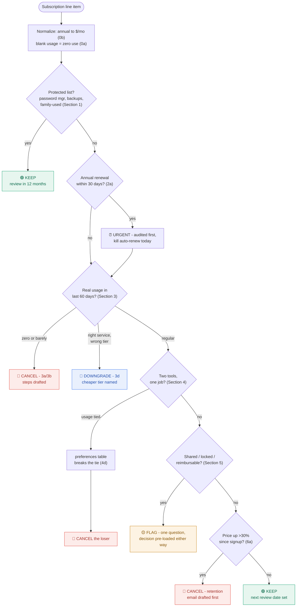

# 💸 Subscription Auditor

**An AI operator whose brain is auditable markdown.** Paste your recurring
charges; get a decision for every one - KEEP, DOWNGRADE, CANCEL, or FLAG -
with the exact rule that fired, the action already drafted (cancellation
steps, retention emails, downgrade paths), and a savings total.

It decides. It doesn't ask you what to do.

**🔎 Live demo:** [ms-codehorizon.github.io/subscription-auditor](https://ms-codehorizon.github.io/subscription-auditor/) - recorded audit in one click, live mode with your own API key, no install.

## Why this project is interesting

Most AI apps bury their behavior in prompts inside code. This one inverts
that: **all decision logic lives in versioned markdown** (`rules.md`), and
three independent interfaces consume the same files with zero logic
duplication:

```
                    ┌── Claude project / Claude Code  (drop the folder in)
 identity.md        │
 rules.md      ──→  ├── Static web console  (demo / bring-your-own-key /
 examples.md        │    copy-prompt - GitHub Pages, no server)
 reference/         │
                    └── Local Flask app  (your key in .env, audit history)
```

Edit one rule in `rules.md` and all three interfaces change behavior
instantly. Every decision in every interface cites its rule number, so you
can audit the auditor. The git history shows the correction loop: rules
that exist because a test run exposed a gap (see `rules.md` Section 0 and Section 4d -
both born from a failed audit, not a brainstorm).

This is [Interpretable Context Methodology](https://github.com/RinDig/Interpreted-Context-Methdology):
folder structure as agent architecture.

## Try it

**Demo (no key, 5 seconds):** open the site (GitHub Pages, or
`python3 -m http.server` from this folder → `localhost:8000/interface/`).
Click **▶ Watch demo audit** - a recorded run over 10 subscriptions with
four edge cases buried in them.

**Live, your key:** same page, **🔑 Run live audit**. Your key stays in
your browser's localStorage and is sent only to `api.anthropic.com` -
this page has no server.

**No key at all:** **📋 Copy prompt for any LLM** assembles the full
operator prompt; paste it into Claude, ChatGPT, Gemini, or any capable
model. Or skip the interface entirely: drop this folder into a Claude
Project (or any assistant that accepts files) and say *"Act as the
operator defined in this folder. Audit my subscriptions: …"*

**Local app with history:** `interface/app.py` (Flask) - your key in
`.env`, every audit logged to `history.json` for month-over-month
comparison. `pip install flask anthropic && python app.py` → `localhost:5050`.

## How it decides

The rules short-circuit - the first section that produces an outcome
wins. Every output cites the rule that fired.



## How the brain works

| File | Job |
|---|---|
| `identity.md` | Scope: what the operator owns, what it refuses to touch |
| `rules.md` | Numbered decision logic, checked in order: Section 0 assumptions → Section 1 protected list → Section 2 renewal urgency → Section 3 usage → Section 4 overlap → Section 5 escalation → Section 6 price/value. First rule that fires decides. |
| `examples.md` | Five worked decisions, including layered edge cases (unused-but-prepaid annual plan; overlap ties broken by a user preferences table) |
| `reference/` | Input format + response/report templates |

Design rules borrowed from ICM: every fact has one home (the interfaces
fetch the md files live - nothing duplicated), specs say *what* not *how*,
and ambiguity is illegal - even ties have a written tiebreaker.

## Security model

- No key ever ships in this repo (`.gitignore` blocks `.env`)
- BYOK mode: key lives in the visitor's browser only, direct to Anthropic
- Flask mode: key read from local `.env`, never logged
- `history.json` (personal audit data) is gitignored

## Edge cases it handles (not hand-waves)

Blank usage data → documented assumption, conservative path (Section 0a).
Annual prepaid but unused → cancel *at renewal* with export plan and
dated reminders, no refund-chasing (2b+1d+3a layered). Two daily-use AI
assistants → preferences table breaks the tie; no coin flips (4d).
Shared service, partner usage unknown → FLAG with the decision
pre-loaded for either answer (5a). Price up 112% since signup →
retention-offer email drafted before cancellation (6a).

## Roadmap

Month-over-month diff audits from `history.json` · bank-statement paste
format · PAUSE as a first-class decision · packaged as a Claude Skill.

---
*Built as an exercise in ICM (folder-as-architecture) - decision logic
you can read, diff, and trust.*
